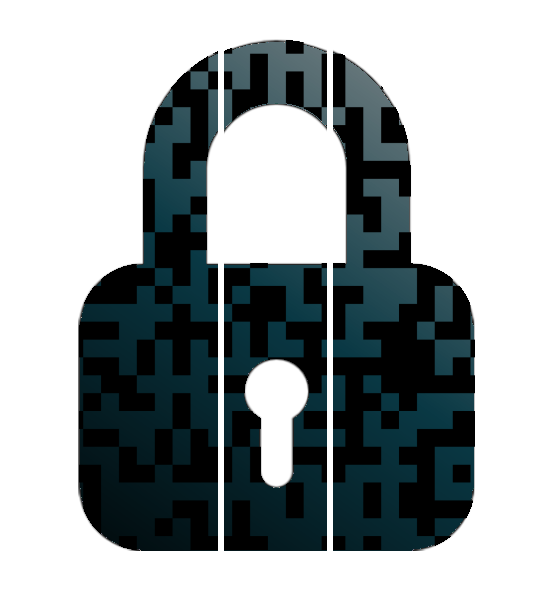
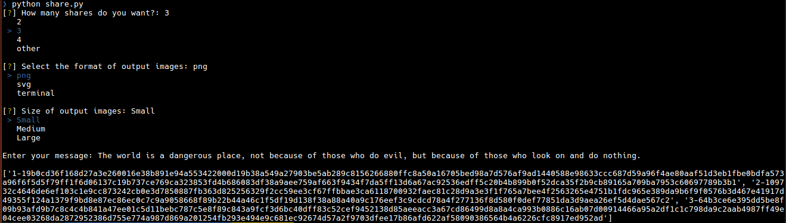
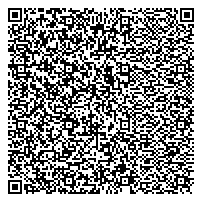
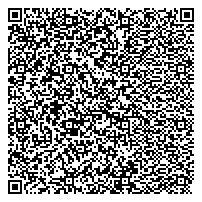
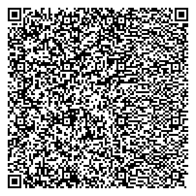
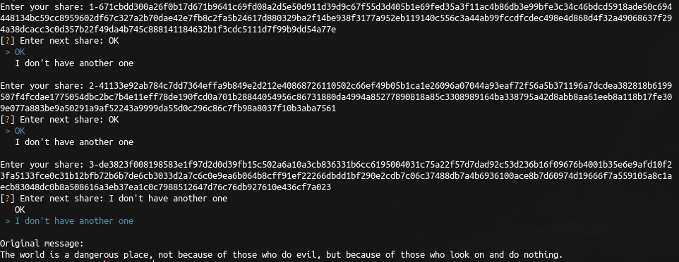

# QR Secret Sharing 

  

## Description
Create QR codes to secret share a message using [Shamir's secret sharing algorithm](https://dl.acm.org/citation.cfm?id=359176). Ideal for cryptocurrency wallet recovery keys, passwords, etc. Protect your message by sharing it to secrets. Print the created QR codes and store them separately somewhere safe.

Shares are not parts of the message. Each share does not reveal any information about the initial message itself. Restoring the initial message needs all shares combined, or a specified minimum amount (default threshold is equal to the number of shares). For more information read [Shamir's secret sharing](https://en.wikipedia.org/wiki/Shamir%27s_Secret_Sharing) algorithm, or [similar work](https://en.wikipedia.org/wiki/Secret_sharing).

## Demonstration

### Sharing
`python2 share.py`

Share 1           | Share 2           | Share 3
:------------------:|:-------------------:|:-------------------:
 |  | 

### Recovering
`python2 recover.py`

## Installation
`pip install -r ./requirements.txt`

## Credits
- [inquirer](https://github.com/magmax/python-inquirer)
- [secretsharing](https://github.com/blockstack/secret-sharing)
- [PyQRCode](https://github.com/mnooner256/pyqrcode)
- [pypng](https://github.com/drj11/pypng)
- [animation](https://github.com/bprinty/animation)
